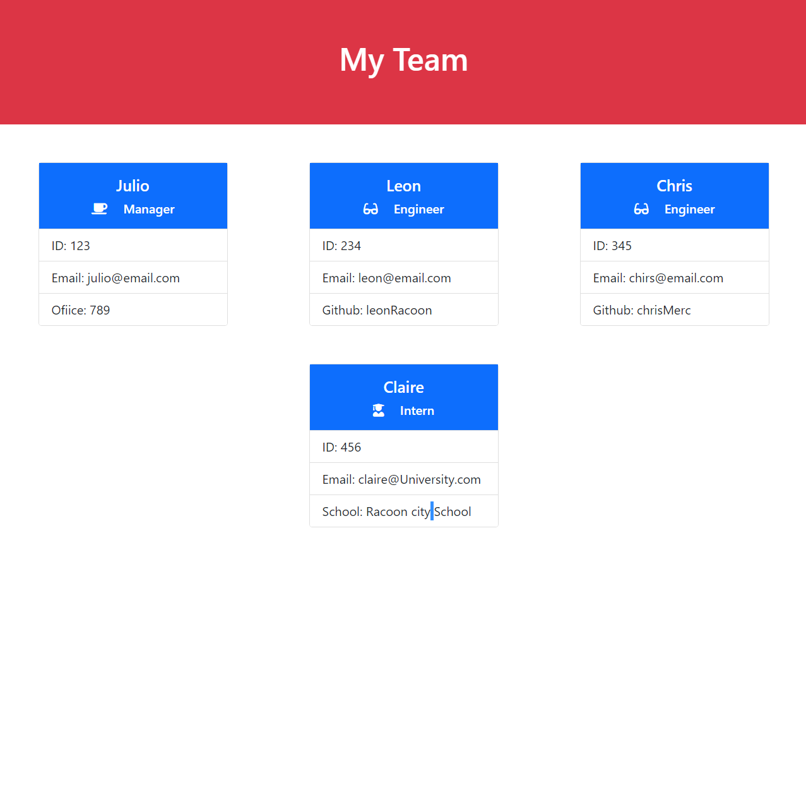

# Team Generator  
A nodejs application to help assemble the needed documentation to create a team. Through a series of questions, using inquirer the user will be able to enter the information being requested, the application once the user enter all desired team members, will generate a html file with the appropiate information.
[app sample Video](https://drive.google.com/file/d/1sgRauBx5aunzPYJtSWZ0nSHxrV_t0iFA/view?usp=sharing)



## Table of Contents:
* [Installation](#installation)
* [Usage](#usage)
* [License](#license)
* [Contributing](#contributing)
* [Tests](#tests)
* [Questions](#questions)
### Installation:
To install dependencies, run the following:
```npm i inquirer```
### Usage:
use the command npm i index.js in order to fire it up!
### License:
This project is licensed under:
none
### Contributing:
Feel free to fork the project and add any contribution, make sure you create a properly and well documented pull request.
### Tests:
To run the test enter the following:
```npm run test```
### Questions:
If you have any questions contact me at [GitHub](https://github.com/julioPlaceres) or contact me at jplaceresvaldes@outlook.com
    
 